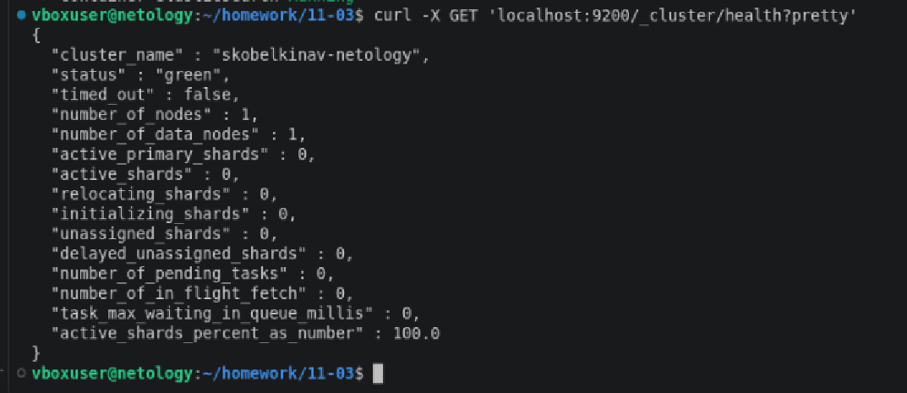
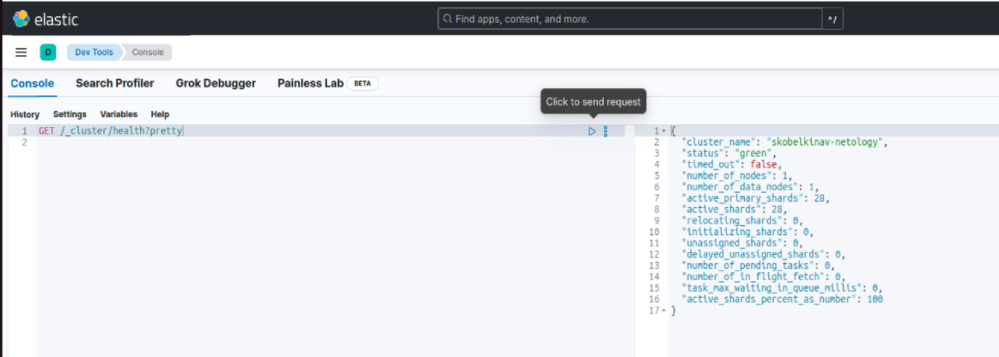
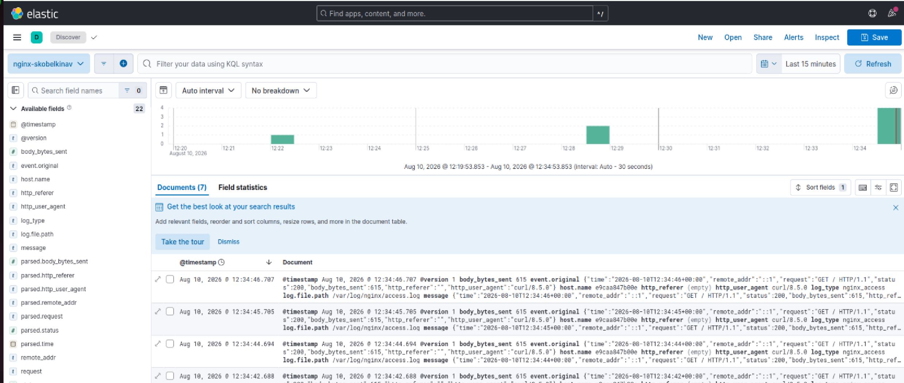

# Домашнее задание к занятию "`Домашнее задание к занятию «ELK»`" - `Скобелкин А.В.`

---
### Задание 1. Elasticsearch

`Установите и запустите Elasticsearch, после чего поменяйте параметр cluster_name на случайный.`

`При необходимости прикрепитe сюда скриншоты
`

### Задание 2. Kibana

`Установите и запустите Kibana.`

`При необходимости прикрепитe сюда скриншоты
`

### Задание 3. Logstash

`Установите и запустите Logstash и Nginx. С помощью Logstash отправьте access-лог Nginx в Elasticsearch.`

`При необходимости прикрепитe сюда скриншоты
`

### Задание 4. Filebeat.

`Установите и запустите Filebeat. Переключите поставку логов Nginx с Logstash на Filebeat.`

`При необходимости прикрепитe сюда скриншоты
`
